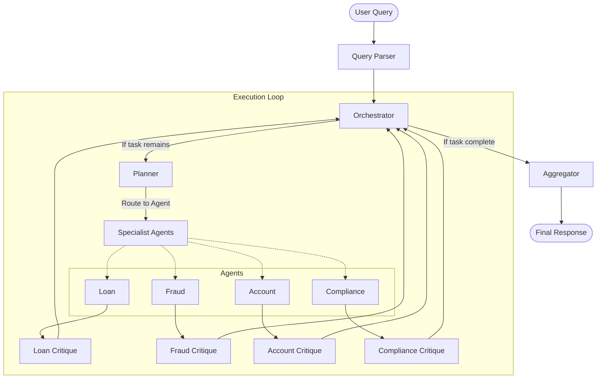

# FincoreAI: Intelligent Banking Assistant

FincoreAI is a sophisticated, multi-agent banking assistant designed to handle complex financial queries with high precision and accountability. Built on a modular, agentic architecture, it leverages specialized agents for different banking domains, ensuring each response is vetted and grounded in data.

## 🚀 Key Features

- **Multi-Agent Orchestration**: Powered by LangGraph for robust, state-full agentic workflows.
- **Specialized Domain Expertise**: Dedicated agents for Loan processing, Fraud detection, Account management, and Compliance.
- **Critique & Refinement Loop**: Every specialist output is reviewed by a Critique agent to ensure accuracy and compliance.
- **RAG & Knowledge Graph Integration**: Grounded in Neo4j and vector search for factual reliability.
- **Audit & Compliance**: Built-in audit logging tracks every step of the agent's reasoning process.
- **Human Escalation**: Automatic detection of high-risk scenarios for human intervention.

## 🏗️ Architecture

The system follows a cyclic, multi-turn architecture where an Orchestrator manages the flow between planning, execution, and final aggregation.



## 🛠️ Technology Stack

- **Framework**: [LangGraph](https://github.com/langchain-ai/langgraph)
- **Model**: Google Gemini Pro (via `langchain-google-genai`)
- **Knowledge Base**: 
  - **Neo4j**: Structured financial data and relationships.
  - **ChromaDB**: Vector store for RAG.
- **Logging**: SQLite for audit trails.
- **Observability**: [LangSmith](https://smith.langchain.com/) for tracing and evaluation.

## 📦 Getting Started

### Prerequisites

- Python 3.9+
- A Google Gemini API Key
- (Optional) Neo4j and LangSmith accounts for full functionality

### Installation

1. **Clone the repository**:
   ```bash
   git clone <repository-url>
   cd FincoreAI
   ```

2. **Set up environment variables**:
   ```bash
   cp .env.example .env
   # Edit .env with your API keys
   ```

3. **Install dependencies**:
   ```bash
   pip install -r requirements.txt
   ```

### Running the Demo

To test the assistant with sample scenarios (Loan Eligibility and Fraud Check):

```bash
python main.py
```

## 📁 Project Structure

- `backend/agents/`: Specialist and Critique agent implementations.
- `backend/graph/`: LangGraph workflow and state definitions.
- `backend/prompts/`: System and user prompts for all agents.
- `backend/utils/`: Helper utilities including Audit Logger and Prompt Loader.
- `backend/db/`: Database initialization and connection logic.
- `data/`: Seed data for Knowledge Graph and RAG.
